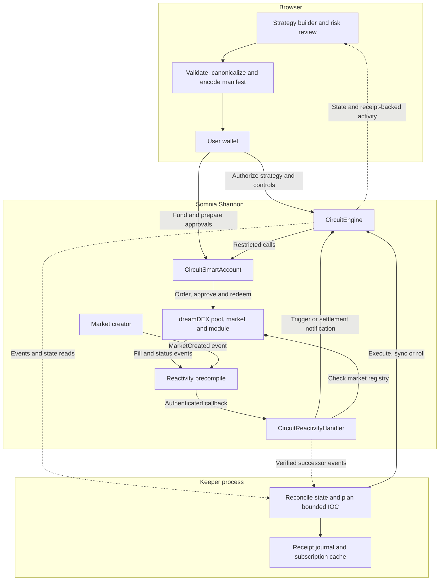
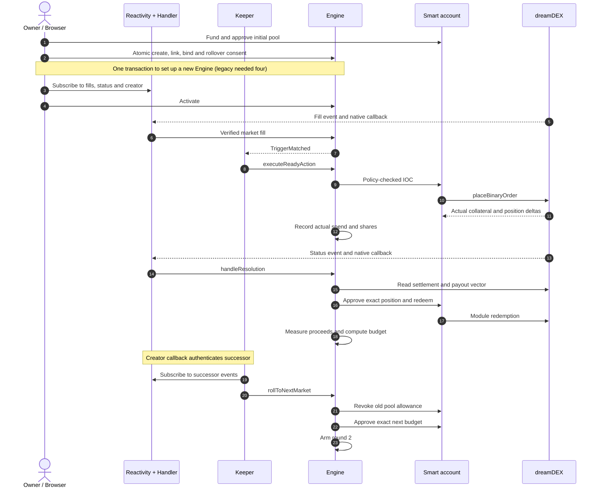
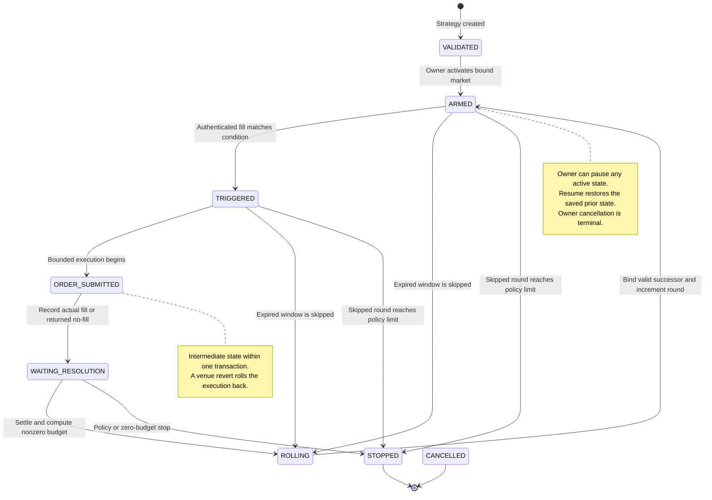

# Circuit Architecture

Circuit turns a supported conditional strategy into an immutable Engine configuration and progresses it across dreamDEX market windows. The design separates **user authorization**, **authenticated market evidence**, **bounded execution** and **venue settlement**.

This document describes the implementation in this repository and the recorded Shannon deployment. The [README](README.md) introduces the product; the [live demo](docs/LIVE_DEMO.md) supplies transaction evidence; the [acceptance report](docs/ACCEPTANCE.md) distinguishes implemented behavior from remaining PRD requirements.

**Navigate:** [Components](#components-and-source-of-truth) · [Strategy representation](#strategy-representation) · [Execution sequence](#activation-and-one-complete-round) · [State machine](#state-machine) · [Risk accounting](#risk-enforcement-and-accounting) · [Trust boundaries](#authority-and-trust-boundaries) · [Recovery](#recovery-failure-handling-and-observability)

## System at a glance



The **Engine** decides whether a transaction is permitted. The **handler** admits market evidence. The **keeper** supplies transaction availability and a candidate order. The **smart account** owns the strategy's collateral and outcome positions.

The browser can close after activation while an enrolled keeper continues to run. The browser's own timers update its display; they do not provide on-chain Reactivity.

## Components and source of truth

| Component | Responsibility | Authoritative input |
| --- | --- | --- |
| [Builder and activation](src/components/ActivationDialog.tsx) | Collect explicit rules, show risk, obtain wallet signatures and wait for successful receipts | User-reviewed manifest and chain preflight |
| [Manifest layer](src/lib/strategy.ts) | Validate required fields, produce canonical JSON, parse supported natural-language intent | Explicit user inputs; missing risk fields remain absent |
| [Config encoder](src/lib/contracts/engine.ts) | Hash canonical JSON and convert decimals/enums to Solidity configuration | Validated manifest |
| [Engine](contracts/src/CircuitEngine.sol) | Store policy/runtime, validate bindings, execute orders, settle positions and compute rollover | Stored config, authenticated callbacks and venue state |
| [Reactivity handler](contracts/src/CircuitReactivityHandler.sol) | Validate callback origin, topics, payload and emitter; authenticate successor metadata | Somnia precompile and BinaryMarketsModule records |
| [Smart account](contracts/src/CircuitSmartAccount.sol) | Hold funds and execute owner or restricted Engine calls | Immutable owner/executor and owner-granted sessions |
| [Keeper](scripts/keeper.ts) | Reconcile enrolled strategies, maintain subscriptions, submit bounded actions and persist receipts | Engine state, pool grid and authenticated successor events |
| [Market discovery](src/lib/dreamdex/discovery.ts) | Find eligible windows through the SDK with a chain-log fallback | Chain status, expiry and market registry validation |
| [Live monitor](src/lib/contracts/monitor.ts) | Read state/events, surface subscription/funding problems and expose sync | Contract reads and successful receipts |

The application uses React, TypeScript, Vite and viem. Venue integration uses `@somnia-chain/markets-sdk`; native callbacks use the Somnia Reactivity SDK/contracts. Solidity compilation and contract tests use Foundry. Exact JavaScript versions are pinned in [package-lock.json](package-lock.json).

## Strategy representation

### One supported lifecycle, explicit configuration

The current language represents one entry trigger, one buy side, a resolution policy and finite continuation limits. The visual graph renders that structure. Free graph composition, arbitrary contract-call nodes and per-round instruction programs are outside this implementation.

A complete v1 manifest looks like this:

```json
{
  "version": 1,
  "name": "Contrarian Roller",
  "series": { "asset": "BTC", "intervalSec": 900 },
  "trigger": { "type": "LAST_FILL_PRICE_ABOVE", "value": "0.700" },
  "action": {
    "type": "BUY_DOWN",
    "maxCollateral": "10.0",
    "maxSlippageBps": 200
  },
  "resolution": {
    "onWin": { "rollPercent": 50 },
    "onLoss": { "incrementConsecutiveLosses": true },
    "onVoid": { "treatAsLoss": false, "treatAsWin": false }
  },
  "policy": {
    "maxTotalCapitalAtRisk": "20.0",
    "maxRounds": 5,
    "stopAfterConsecutiveLosses": 2,
    "minSecondsToExpiry": 120
  }
}
```

Supported assets are BTC and ETH; supported intervals are 900 and 3,600 seconds. Entry conditions compare the **last authenticated UP fill price** strictly above or below a threshold. Executable sides are BUY UP and BUY DOWN. A displayed order-book quote does not itself become trigger evidence.

### From intent to contract configuration

1. `compileIntent` extracts supported fields from natural language into a partial draft. It does not merge missing risk fields with the builder preset.
2. `validateManifest` checks required values, enums, decimal precision and policy ranges. Incomplete drafts cannot be activated through the UI.
3. `canonicalManifest` recursively sorts object keys and serializes JSON. Decimal strings retain their supplied representation: `"0.7"` and `"0.700"` can have different hashes despite encoding the same price.
4. `manifestHash` computes `keccak256` over the canonical JSON bytes. `manifestToEngineConfig` encodes the executable fields using fixed-point integers and enums.
5. `createStrategy` records the owner, manifest hash and validated config. The strategy ID incorporates the owner, its nonce and the manifest hash.

The Engine does **not** parse JSON or recompute its relationship to the submitted config. That pairing is produced by the client and authorized by the caller. The hash anchors the reviewed document; the stored config is the actual execution authority. Recovery checks the saved manifest hash and owner against the chain. An edit requires a new strategy to change executable policy.

## Activation and one complete round

The sequence groups native callback delivery and handler validation into one participant; the component diagram shows them separately.



The initial wallet review checks deployed bytecode, Engine/handler wiring, account ownership/executor, market eligibility, funding/allowance and subscription-owner balance. The UI currently uses a configured smart-account address. It does not deploy a new account for every browser visitor or automatically register that visitor with a hosted keeper.

In the supported automation path, the keeper calls the Engine and the Engine calls the user's account. The pool sees the account as the direct trader. This path was used because the observed Shannon delegated `placeBinaryOrderFor` route rejected arbitrary contracts with `OnlyApprovedContracts()`.

The separate browser SDK IOC probe remains a manual wallet action. Its trades do not advance Engine accounting and are not part of the automated sequence above.

## State machine



`PAUSED` remembers `pausedFrom`; it suspends order execution, settlement and rollover. Resume restores that state. It does not replay a successful action. A pause does not cancel subscriptions or withdraw collateral.

`CANCELLED` stops lifecycle progression. The current cancellation method changes state; it does not automatically redeem an open position or release handler bindings. Account-owner operations and binding cleanup remain operational responsibilities. The live demo deliberately ends **PAUSED** after arming round 2.

An IOC may partially fill. If the venue returns no position, the Engine records `OrderSkipped`; settlement later treats it neutrally. If the venue **reverts** with no fill, the entire execution reverts, including the action marker. The keeper may retry within the window. Expiry sync can then skip the unexecuted round.

## Risk enforcement and accounting

The Engine rechecks risk at execution even if browser review and keeper simulation previously succeeded.

| Invariant | Enforcement |
| --- | --- |
| Eligible trading window | Bound market must be Trading and outside the configured expiry buffer at binding, activation and order execution |
| Venue grid | Price must align to tick size; quantity must satisfy lot size and minimum quantity |
| Slippage | Candidate outcome cost cannot exceed the authenticated trigger cost plus the approved bps |
| Per-order limit | Maximum order collateral is positive and capped at 10 test collateral units in this P0 build |
| Lifetime spending limit | Actual collateral outflow accumulates in `cumulativeCapitalUsed`; redeemed funds do not reset it |
| Finite progression | Maximum rounds, consecutive-loss stop, remaining capital and zero rollover budget govern continuation |
| Actual position tracking | Received ERC-6909 balance delta establishes the redeemable position for this round |
| Replay protection | Callback IDs and per-strategy/round/market/action keys prevent repeated successful processing |
| External calls | Order execution, sync/settlement and automatic rollover use the Engine's reentrancy guard |

For this six-decimal venue, let `S = 1,000,000` and `BPS = 10,000`:

```text
outcomePrice = yesLimitPrice                    for BUY UP
outcomePrice = S - yesLimitPrice                for BUY DOWN

remainingCap = maxTotalCapitalAtRisk - cumulativeCapitalUsed
budget       = min(nextOrderBudget, maxOrderCollateral, remainingCap)
maxSpend     = ceil(quantity × outcomePrice / S)

require maxSpend <= budget
require outcomePrice <= floor(observedOutcomePrice × (BPS + slippageBps) / BPS)
```

The [keeper planner](src/lib/automation/order-plan.ts) uses bigint arithmetic to round the price within the allowed adverse-slippage boundary, then floors quantity to the pool's lot size. Solidity independently verifies that plan.

Before and after placement, the Engine reads the execution account's collateral and selected outcome balance. It records **actual collateral spent** and **actual shares received**, including partial fills, and checks the observed spend against the plan.

### Resolution and the next budget

A status callback is a notification. The Engine independently reads `isResolved()`, `isVoided()` and `payoutNumerators()` from the bound market. Non-void resolution must match the supported one-hot binary payout model; a non-void distribution with both sides paying is rejected.

The Engine grants the BinaryMarketsModule an exact ERC-6909 allowance for the tracked position, redeems through the smart account and verifies that the position decreased by exactly that amount. Realized proceeds equal the account's collateral increase.

| Result | Loss counter | Desired next budget before caps |
| --- | --- | --- |
| WIN | Reset to zero | `floor(realizedProceeds × rollPercentBps / BPS)` |
| LOSS | Increment by one | `maxOrderCollateral` |
| VOID | Preserve | `maxOrderCollateral` |
| SKIPPED | Preserve | `maxOrderCollateral` |

The final budget is capped by both `maxOrderCollateral` and the remaining lifetime spend allowance. A zero budget stops the strategy. A loss or void can therefore require pre-funded collateral for another round. Permission to spend does not create funds.

## Market discovery and successor authentication

Initial discovery attempts the Markets SDK/indexer with an eight-second deadline. If it fails, [chain discovery](src/lib/dreamdex/chain-discovery.ts) searches recent creator logs, checks creator ownership against the configured deployment, verifies module records, and reads current market status and expiry. RPC scans use 1,000-block ranges, up to 40,000 recent blocks.

This is a bounded fallback. No eligible result blocks activation; it does not silently reuse an expired market. A chain-discovered snapshot may lack SDK symbol metadata, so the manual SDK probe can remain unavailable while the direct account path is usable.

Automatic successor binding has an additional requirement: the handler must have authenticated the creator's `MarketCreated` callback. The callback's market, pool, collateral, token IDs, times and oracle question are checked against the immutable module's record. Supported asset/cadence metadata is cached under `marketId`.

The Engine then requires:

- prior owner consent via `setAutomaticRollover(strategyId, true)`;
- `ROLLING` state and verified metadata for the same creator, asset and cadence;
- registry-consistent addresses and outcome IDs, unchanged collateral and outcome-token contract;
- a later expiry, no overlap with the prior window, and a currently eligible Trading market.

A successful automatic rollover removes the old handler bindings, binds the successor, zeros the old ERC-20 pool allowance and sets the new allowance to exactly `nextOrderBudget`. These changes are atomic. Discovery in the keeper alone cannot bypass the handler's metadata requirement.

## Authority and trust boundaries

| Actor | Authority | Boundary |
| --- | --- | --- |
| Strategy owner | Create/activate, initial binding, account linkage, pause/resume/cancel, automatic-rollover consent | Must own the strategy; linked account must report the same owner and this Engine as executor |
| Account owner | Execute account calls and grant/revoke optional sessions | Controls the account's funds directly |
| Keeper or other caller | Invoke bounded execution, sync and consented automatic rollover | Engine state, market authentication and policy checks govern success |
| Reactivity precompile | Deliver `onEvent` callbacks | Inherited handler entrypoint accepts only precompile `0x0100` |
| Engine admin | Replace the configured Reactivity handler | Administrative trust remains in event admission |
| Handler owner | Replace its Engine pointer and manage emitter bindings | Administrative wiring and liveness authority |
| dreamDEX and market creator | Market registry, order matching, resolution and series metadata | External venue/oracle behavior and creator authenticity are dependencies |

The smart account's immutable executor is the Engine. Executor calls are selector-restricted to binary placement, ERC-20 approval, ERC-6909 approval and module redemption. The **Engine** constrains destination addresses and amounts; the account's selector filter is not a second independent policy engine.

Optional account sessions authorize a target, selector and expiry. They do not enforce the strategy's capital limits themselves and are not used by the normal keeper path. The live keeper used the owner signer; the local integration separately proves execution and rollover with a non-owner keeper signer.

The Engine stores validated bounds, but administrative replacement of its handler changes who can submit trusted trigger evidence. This deployment therefore retains privileged wiring and should not be described as fully trustless or operationally decentralized.

The on-chain initial binding verifies market registry/address/cadence consistency and records the creator. The selected asset label is sourced by client discovery at that stage; subsequent automatic bindings additionally enforce the handler's authenticated asset metadata.

## Recovery, failure handling and observability

| Condition | Current behavior |
| --- | --- |
| Missed resolution callback | `syncStrategy(id, marketId)` reads actual settlement and runs the same redemption path |
| Missed fill callback | Sync cannot invent a price; an already-triggered action can recover, otherwise the expired round is skipped |
| Keeper restart | Read current Engine state; reuse and verify cached subscription IDs; successful action keys prevent duplicate spending |
| WebSocket failure | Record degradation; 30-second reconciliation continues |
| Subscription owner under 32 STT | Surface `AUTOMATION_PAUSED`; settlement/expiry sync remains available |
| RPC or indexer failure | Transport fallback, bounded chain discovery, explicit errors and subsequent reconciliation |
| Missing successor callback | Stay `ROLLING`; no unverified successor is forced into the strategy |
| Insufficient allowance or funds | Order fails; live UI exposes the current-pool problem; keeper does not replenish funds |
| Owner pause | Preserve the prior state and position; no automatic execution or settlement progression |
| Browser reload | Verify saved owner and manifest hash against the configured Engine, then restore live reads |

The keeper persists `keeper.jsonl` and an Engine-specific subscription cache under its evidence directory. One daemon per signer avoids nonce contention. Its enrollment is the explicit `CIRCUIT_STRATEGY_IDS` list; there is no hosted enrollment API in this repository.

The browser reads live state every five seconds and derives activity from contract events. It monitors the saved activation subscriptions and current execution funding/allowance. It does not yet offer a complete service-health view of every keeper-created successor subscription. Recovery history reads are bounded to recent blocks; local storage is a recovery hint, not chain authority.

A single handler binding currently routes each emitter to one strategy. A second strategy cannot overwrite an active binding. Multi-tenant callback fan-out and subscription aggregation require further design.

## Evidence and verification

There are three distinct verification layers:

| Layer | What it establishes |
| --- | --- |
| TypeScript and Forge tests | Deterministic encoding/planning, account permissions, bounded state transitions, replay handling, win/loss/void behavior and sync |
| Actual keeper on local Anvil | Process integration, separate signers, restart recovery, subscriptions and consent-gated automatic successor approval |
| Real Shannon receipts | Actual subscription callbacks, bounded IOC fill, losing-position redemption, creator-authenticated rollover and final allowances |

[finalize-live-evidence.ts](scripts/finalize-live-evidence.ts) matches seed-fill topics/data to the handler transaction, verifies successful receipts and Engine execution, reads the final paused state and checks old/new allowances. Its [audit](deployments/evidence/live-demo/audit.json) is a reproducible verification artifact; it is not an external security audit.

The real proof does not establish live winning redemption or void behavior. Those paths have local coverage. The [acceptance report](docs/ACCEPTANCE.md) also tracks the outstanding Somnia Agent integration, live market availability, UX validation and service-enrollment work.

For deployment commands and configuration, return to the [README](README.md#run-locally). For operation and incident recovery, use the [keeper runbook](docs/AUTOMATION.md). Product requirements remain in the [locked PRD](Circuit_PRD_v1.0_LOCKED.md).


## Graph compiler and bounded ladder extension

The editable graph document and compiler live in `src/lib/graph.ts`. The compiler validates the supported typed ports before producing the exact Strategy Manifest; rule/edge changes invalidate its compilation key. Layout is not part of that key. Optional `action.sizing` describes a WIN_LADDER with explicit initial and increment collateral. A ladder-aware Engine stores this separately from the existing StrategyConfig ABI, initializes it during atomic setup, increases only after WIN, and applies the same order, lifetime capital and round limits. First-loss stopping is mandatory. Existing deployments without `ladderSetupVersion()` are blocked from ladder activation. See [programmable P0 acceptance](docs/PROGRAMMABLE_P0.md) for the complete grammar, evidence rules and deployment boundary.
