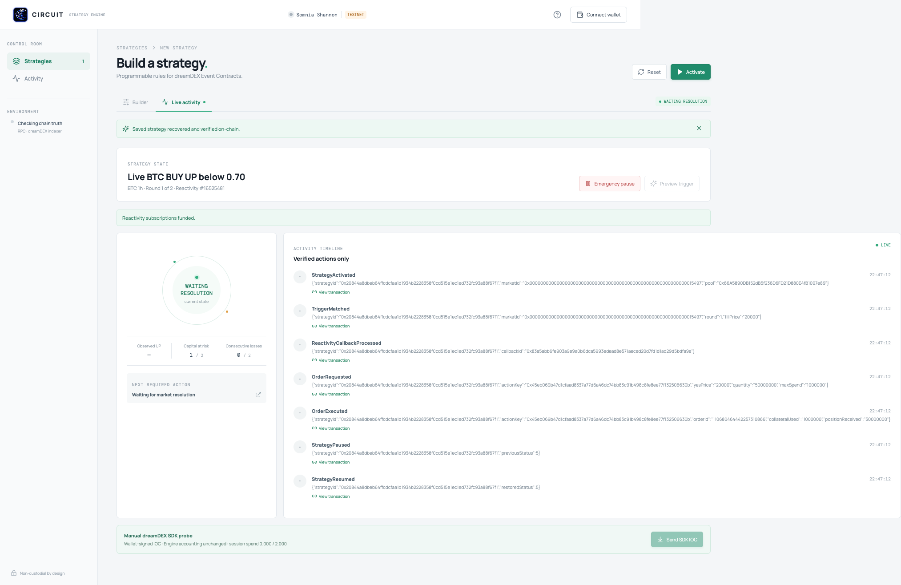

<p align="center">
  
</p>

# Circuit

**Define the rules. Bound the capital. Verify every transition.**

Circuit lets users configure conditional trading strategies for **dreamDEX Event Contracts**, approve a deterministic manifest, and execute across market windows on **Somnia**. A user-owned smart account holds the funds. On-chain Reactivity delivers market events. A keeper submits transactions that the Engine checks against the approved strategy.

**[Architecture](ARCHITECTURE.md) · [Live demo](docs/LIVE_DEMO.md) · [Video](deployments/evidence/live-demo/circuit-live-cycle.mp4) · [Deployment](deployments/shannon.json) · [Acceptance evidence](docs/ACCEPTANCE.md)**

## A complete cycle, verified on Shannon

On **6 September 2026**, Circuit completed a real testnet lifecycle:

```text
Activate → Reactivity callback → Keeper order → Fill
         → Resolution callback → Redeem → Automatic successor → Round 2
```

The strategy bought **50 UP shares for 1 tUSDC** in a BTC 1h market. The market resolved LOSS. Circuit redeemed the tracked position for zero proceeds, authenticated the next market, revoked the old pool allowance, and approved exactly **1 tUSDC** for round 2. The owner then paused the strategy and the keeper stopped. The final recorded account balance was **1 tUSDC**.

| Proof | Recorded evidence |
| --- | --- |
| Real callback and automatic order | [Callback transaction](https://shannon-explorer.somnia.network/tx/0xfe816d6588142202de86143f2c23a00411b51c768df2d81d2a25ff52a67a37e4) · [Engine order transaction](https://shannon-explorer.somnia.network/tx/0xb9561543c7839b00691ffd62e488a7e497bbefd56edda18f721ec20d37c15d91) |
| Resolution and redemption | [Resolution callback transaction](https://shannon-explorer.somnia.network/tx/0xf606387aeda808c1906132412b62d21d9d6f767a385259923c6e3a0e6401e776) |
| Automatic successor and bounded approval | [Rollover transaction](https://shannon-explorer.somnia.network/tx/0xec259cfe0e4cdc5d9d8936e5e6c040fd391c431786932d757a6069621bcf078d) |
| Receipts, final state and allowances | [Independent receipt audit](deployments/evidence/live-demo/audit.json) · [Standalone evidence viewer](deployments/evidence/live-demo/index.html) |
| Local verification | **26 TypeScript tests + 37 Forge tests**, keeper integration, production build and tools typecheck; [recorded scope](docs/ACCEPTANCE.md) |

The [59-second video](deployments/evidence/live-demo/circuit-live-cycle.mp4) is a real evidence-dashboard recording at **20× speed**. Recording starts after the fill, displays the earlier transaction evidence, and captures the live resolution and rollover. The [demo report](docs/LIVE_DEMO.md) documents the explicit test strategy, owner-controlled seed trade and use of public book liquidity.

<details>
<summary>View the live monitor during the recorded run</summary>



This capture shows the position awaiting resolution. The completed result and final paused state are documented above.

</details>

## Why Circuit exists

A rolling event market gives each window its own market identity, expiry and pool. A recurring strategy therefore needs more than an entry signal: it must verify the current venue, respect an execution budget, settle the position and authorize the correct successor.

Circuit expresses those decisions in a reviewable strategy and enforces the supported rules through one Engine. The current builder exposes a **structured strategy graph** with configurable thresholds, sides and policies. Its topology follows the supported v1 lifecycle.

For example, the Contrarian Roller configuration expresses:

```text
WHEN BTC 15m UP last fill > 0.70
BUY DOWN with at most 10 tUSDC and 200 bps slippage
ON WIN allocate 50% of redeemed proceeds to the next order, within all caps
CONTINUE for at most 5 rounds; stop after 2 consecutive losses
LIMIT cumulative collateral spent to 20 tUSDC; require 120s before expiry
```

This is a configuration example. The recorded live demo used a separately approved **BTC 1h / BUY UP below 0.70** strategy. Market discovery must find an eligible live window before activation.

## What is implemented

| Capability | Behavior |
| --- | --- |
| Strategy review | Visual rules, explicit risk limits, canonical JSON and a deterministic manifest hash |
| Intent compilation | A local natural-language parser produces a draft; missing mandatory risk fields remain incomplete |
| Bounded execution | Strict above/below fill triggers, BUY UP / BUY DOWN, IOC orders, tick/lot alignment and slippage checks |
| Account ownership | Collateral and positions live in a user-owned account; the Engine has a restricted execution path |
| Event-driven progression | Real subscriptions for pool fills, market status changes and creator market announcements |
| Settlement and rollover | On-chain resolution reads, exact-position redemption and explicitly authorized successor approvals |
| Recovery and observability | Keeper restart recovery, permissionless settlement/expiry sync, pause/resume, explorer links and verified browser-session recovery |

The capital cap currently measures **cumulative collateral spent**. Redemptions do not replenish it. A successful order consumes that lifetime budget even when its position later wins.

For the component map, transaction sequence, state machine, accounting equations and authority model, read **[ARCHITECTURE.md](ARCHITECTURE.md)**.

## Run locally

Use **Node.js 24** and npm for the recorded setup. Install **Foundry** (`forge` and `anvil`) for contracts and keeper integration tests. The lockfile pins JavaScript dependencies; [foundry.toml](foundry.toml) pins Solidity **0.8.30**.

```bash
npm ci
npm run dev
```

Open `http://localhost:5173`. Read endpoints have defaults; wallet transactions require Shannon configuration and an eligible market.

For a new checkout, create a local configuration without replacing an existing one:

```bash
cp -n .env.example .env.local
```

| Setting | Purpose |
| --- | --- |
| `VITE_CIRCUIT_ENGINE_ADDRESS` | Public Engine address used by the browser |
| `VITE_CIRCUIT_HANDLER_ADDRESS` | Public Reactivity handler address |
| `VITE_CIRCUIT_SMART_ACCOUNT_ADDRESS` | Account owned by the wallet that will activate the strategy |
| `VITE_SOMNIA_RPC_URL` / `VITE_SOMNIA_WS_RPC_URL` | Optional public transport overrides; see [.env.example](.env.example) for fallbacks |
| `CIRCUIT_OPERATOR_PRIVATE_KEY` | Server/CLI signer for deployment and keeper transactions |
| `CIRCUIT_STRATEGY_IDS` | Explicit comma-separated strategy IDs serviced by the keeper |

Private signer material belongs only in the ignored local environment. `VITE_*` values are public browser configuration.

### Deploy and activate your own strategy

1. Configure the CLI signer in `.env.local` and fund it with Shannon STT for gas.
2. Run `npm run contracts:deploy`. Set the returned Engine and handler addresses in the public configuration.
3. Run `npm run smart-account:deploy`. Set its returned account address and restart Vite. This script makes the CLI signer the account owner; connect that same wallet in the browser.
4. Choose an eligible market and review a complete manifest. **Prepare account** requests any missing test collateral and the current-pool allowance.
5. Authorize activation. The wallet creates the strategy, links the account, binds the market, authorizes bounded automatic rollover, creates three subscriptions, then arms the strategy.
6. Run a keeper for the resulting strategy ID.

The activation flow checks ownership, deployment wiring, market status, expiry buffer and the configured **32 STT** subscription-owner minimum. Initial preparation funds one maximum order; fund the account for additional rounds when needed. The keeper does not faucet or transfer funds automatically.

The [recorded deployment](deployments/shannon.json) is available for inspection. Its demo account belongs to its recorded owner; it is not an account that another connected wallet can operate.

### Run the keeper

Simulate one reconciliation pass:

```bash
CIRCUIT_STRATEGY_IDS=0xYOUR_STRATEGY_ID npm run keeper -- --once
```

Run the transaction-signing daemon:

```bash
CIRCUIT_STRATEGY_IDS=0xYOUR_STRATEGY_ID npm run keeper -- --execute
```

The keeper watches Engine/handler events and reconciles every 30 seconds. The owner authorizes automatic rollover once; a keeper can then progress authenticated successors within the Engine's constraints. Preserve its receipt journal and subscription cache across restarts. A browser activation does not automatically enroll a strategy in a hosted keeper service.

See [keeper operations](docs/AUTOMATION.md) for signer configuration, recovery and the optional owner-run fallback.

## Verify the implementation

| Command | Checks |
| --- | --- |
| `npm test` | Manifest validation, hashing/config encoding, order planning, wallet/discovery helpers, subscription decoding and session parsing |
| `npm run contracts:test` | Engine accounting, authorization, callbacks, settlement, replay protection and successor rules |
| `npm run test:keeper` | Actual keeper process with separate disposable signers on local Anvil; execution, restart, redemption and consent-gated rollover |
| `npm run typecheck:tools` | TypeScript CLI and integration tooling |
| `npm run build` | Frontend typecheck and production bundle |
| `npm run contracts:abi` | Regenerate the frontend lifecycle ABI from Foundry artifacts after contract changes |

Local integration uses a mock venue and a local precompile fixture. The [Shannon receipt audit](deployments/evidence/live-demo/audit.json) is the separate evidence for real callbacks and settlement.

## Current boundaries

The working live cycle is complete; the full PRD acceptance matrix remains tracked in [ACCEPTANCE.md](docs/ACCEPTANCE.md).

- The builder follows a fixed v1 graph. Free node/edge composition and arbitrary programs are outside the current implementation.
- The intent compiler is local. The planned Somnia Agent integration remains outstanding.
- The recorded live proof covers BUY UP and a losing resolution. Live BUY DOWN, winning redemption and void acceptance remain open; winner/void paths have local contract coverage.
- BTC/ETH and 15m/1h configurations are supported, but availability is checked on chain. The recorded run used 1h because the observed 15m series was stale.
- Handler bindings currently support one active strategy per emitter. Automatic cross-user keeper enrollment and production subscription aggregation are not implemented.
- The deployment has administrative wiring authority. Review the [trust boundaries](ARCHITECTURE.md#authority-and-trust-boundaries) before treating it as a production service.

## Explore the repository

| Location | Responsibility |
| --- | --- |
| [src/App.tsx](src/App.tsx) · [ActivationDialog](src/components/ActivationDialog.tsx) | Builder, wallet review and live state |
| [src/lib/strategy.ts](src/lib/strategy.ts) · [contract encoding](src/lib/contracts/engine.ts) | Manifest validation, canonicalization and executable configuration |
| [contracts/src](contracts/src) | Engine, Reactivity handler, smart account and venue interfaces |
| [scripts/keeper.ts](scripts/keeper.ts) | Automatic execution, subscriptions, sync and successor reconciliation |
| [src/lib/dreamdex](src/lib/dreamdex) | SDK integration, market discovery and chain fallback |
| [deployments](deployments) | Deployment records, receipts, audits and demo artifacts |

**Continue reading:** [Architecture](ARCHITECTURE.md) · [Engine notes](docs/ENGINE.md) · [Keeper runbook](docs/AUTOMATION.md) · [Integration findings](docs/INTEGRATION_SPIKE.md) · [Locked PRD](Circuit_PRD_v1.0_LOCKED.md)
